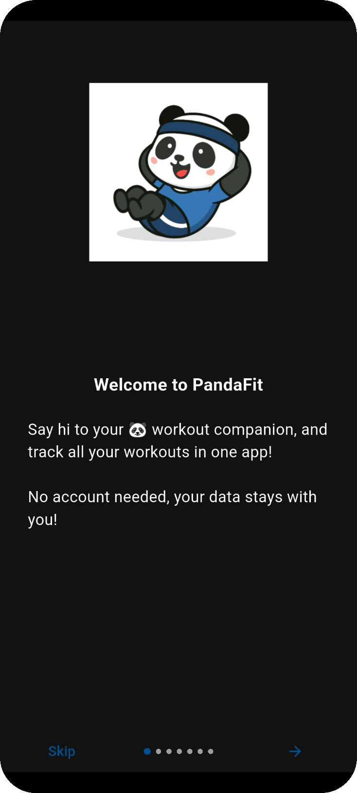
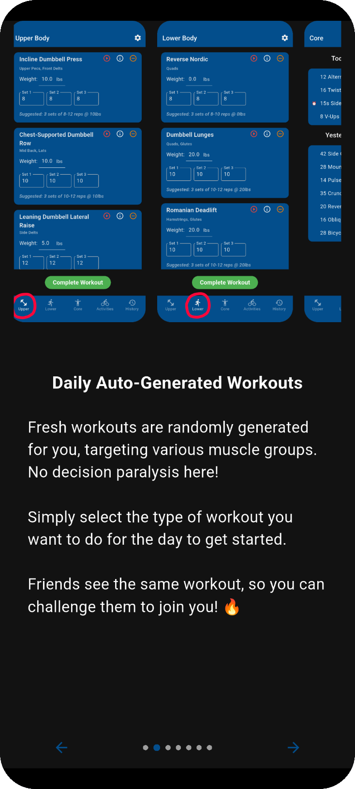
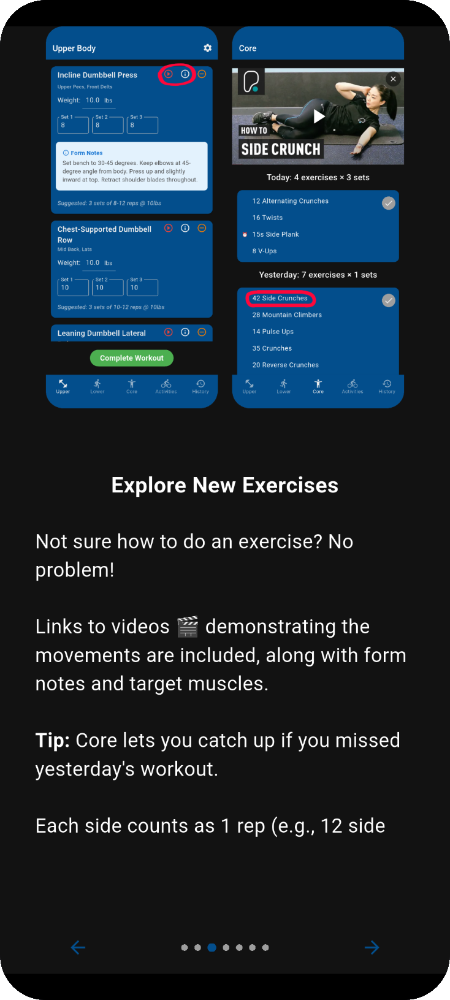
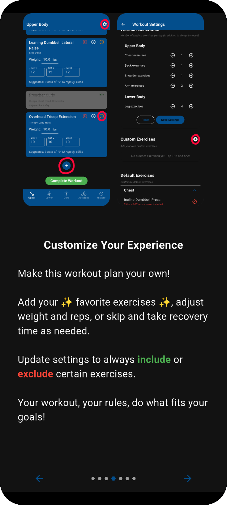
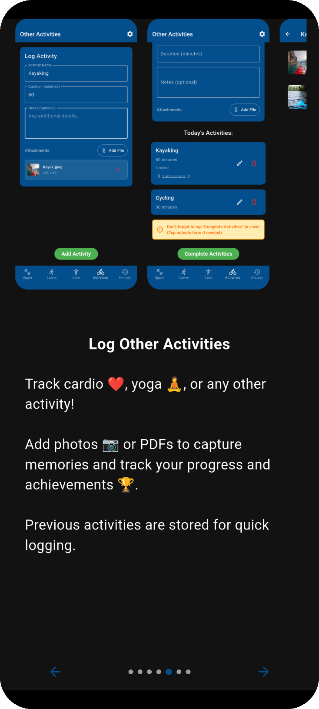
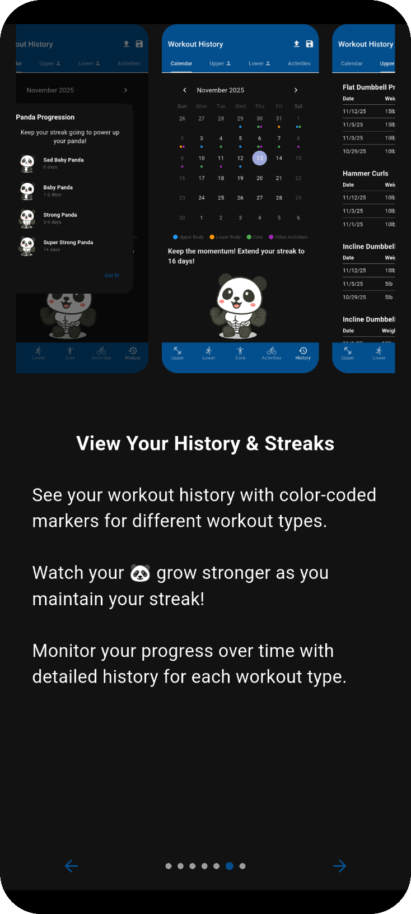
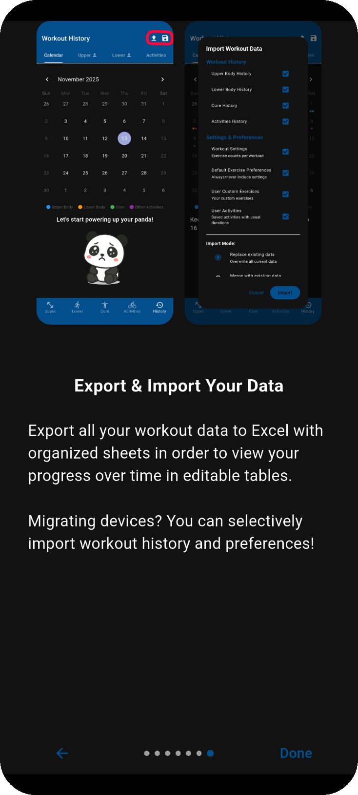

# PandaFit App

A simple mobile app built with Flutter that makes fitness workouts engaging and fun, with something new each day. Meant to be a no-frills, offline app, not requiring creation or access to any accounts.

This app lets you generate personalized workouts for different muscle groups each day, includes a built-in timer, lets you see your workout history, and makes it easy to log and track your progress with smart weight suggestions.

## Features

- **Four workout types**: Upper Body, Lower Body, Core, and Other Activities
  - **Upper & Lower Body**: Separate exercise cards with weight tracking, progressive overload suggestions, and automatic rep range recommendations
  - **Core**: Single workout card format with all exercises displayed together, includes yesterday's catchup option
  - **Other Activities**: Log non-gym activities like kayaking, cycling, taekwondo, etc. with duration and notes
- **Smart workout generator**: Generates randomized daily workouts with volume-based scaling and deterministic seeding (same workout for the same day so you can do the same exercises together with a friend!)
- **Streak tracking**: Panda mascot evolves as you build workout streaks
- **Customizable workouts**: Full control over workout generation
  - **Exercise preferences**: Mark exercises as "always include", "never include", or random selection
  - **Custom exercises**: Create your own exercises with custom weights, rep ranges, form notes, and video links
  - **Workout generation settings**: Control how many exercises are selected from each muscle group
  - **Add exercises during workout**: Add standard or custom exercises to your active workout on the fly
- **Exercise timer**: Built-in countdown timer for timed exercises (planks, holds) with progress indicator and audio alarm
- **Activity tracking**: Tracks completed workouts by muscle group in a calendar view with color-coded dots
- **Progress tracking**: View exercise history with weight and rep progression in the Upper Body and Lower Body tabs
- **Device migration**: Easily transfer all your workout data, custom exercises, and preferences to a new device
  - **Excel-based data export**: Export all workout data to organized Excel spreadsheets with 8 sheets (Upper Body, Lower Body, Core, Activities history, plus settings and preferences)
  - **Selective data import**: Import dialog lets you choose which data to import (workout history, settings, custom exercises, etc.) with replace or merge options
- **Yesterday's catchup**: Core workouts allow completing yesterday's missed workout
- **Video links**: Each exercise includes an in-app YouTube video link for proper form demonstration

## Screenshots
<div style="text-align: left;">
  
  
  
  
  
  
  
</div>

## Getting Started

### Prerequisites

- **Flutter** is required to build the app for both Android and iOS. To install Flutter, follow the instructions on the official Flutter website: [Flutter Installation Guide](https://flutter.dev/docs/get-started/install).
- **Android SDK** is needed to develop and run the app on Android devices. The Android SDK is included with Android Studio. Download and install **Android Studio**: [Download Android Studio](https://developer.android.com/studio).
- Once you have Flutter and the required SDKs installed, run `flutter doctor` to check for any missing dependencies and verify your environment setup.

### Installation

1. Clone the repository:
   ```bash
   git clone https://github.com/AMWen/pandafit.git
   cd pandafit
    ```

2. Install dependencies:
```bash
flutter pub get
```

3. Once you're ready to release the app, you can generate a release APK or appbundle using the following commands:

For android:
```bash
flutter build apk --release
flutter build appbundle
```

See instructions for [Signing the App for Flutter](https://docs.flutter.dev/deployment/android#sign-the-app) and [Uploading Native Debug Symbols](https://stackoverflow.com/questions/62568757/playstore-error-app-bundle-contains-native-code-and-youve-not-uploaded-debug)

You may also need to remove some files from the bundle if using a MacOS.
```bash
zip -d Archive.zip "__MACOSX*"
```

For iOS (need to create an an iOS Development Certificate in Apple Developer account):
```bash
flutter build ios --release
```

## Video Support

Watch exercise form videos while following your workout!

### Inline Video Player (Direct Links)
For exercises with direct video links:
- **Upper & Lower Body**: Video player appears inline above the exercise card, auto-scrolling to show the video at the top
- **Core Exercises**: Video opens in an integrated YouTube player with Picture-in-Picture support
  - **On Android**: Press the home button or switch apps to activate PiP mode - the video continues playing in a small floating window
  - **On iOS**: PiP support varies by device and iOS version
  - Tap the info icon in the video player for PiP instructions

### YouTube Search Links
Exercises without direct video links open YouTube search results in your external browser/app, allowing you to browse multiple form videos for the exercise.

## Workout Types

### Upper Body & Lower Body Workouts
- Individual exercise cards for each exercise
- Track weight and completed sets per exercise
- Smart weight suggestions based on workout history with progressive overload
- Auto-populated rep counts based on rep range
- Skip exercises or add new ones during your workout
- Customize exercise preferences (always/never include, custom weights/reps)
- Create and save custom exercises
- Completion tracked per muscle group
- History shows weight progression over time

### Core Workouts
- Single workout card displaying all exercises
- Deterministic daily generation (same workout for the same day)
- Volume-based scaling for varying difficulty
- Includes today's and yesterday's workouts for catchup
- Timed exercises with built-in countdown timer (⏰ icon)
- Completion tracked separately in calendar view

### Other Activities
- Log non-traditional workouts and activities
- Track activity name, duration (minutes), and optional notes
- Auto-complete from previously logged activities
- Pre-fills usual duration for saved activities
- Save incomplete activities for later completion
- Manage saved activities in settings
- Dedicated tab in History screen for viewing activity logs
- Completion tracked in calendar view with dedicated color

## Project Structure

```bash
lib/
├── data/
│   ├── models/
│   │   ├── exercise_model.dart                # Upper/Lower body exercise & routine models
│   │   ├── core_exercise_model.dart           # Core exercise & routine models
│   │   ├── activity_model.dart                # Activity & routine models
│   │   ├── history_models.dart                # Shared models for exercise and activity history
│   │   └── custom_exercise_preferences.dart   # Custom exercise preferences models
│   ├── services/
│   │   ├── localdb_service.dart               # SQLite database with all workout methods
│   │   ├── excel_export_service.dart          # Excel export with 8 organized sheets
│   │   ├── excel_import_service.dart          # Excel import with selective data loading
│   │   ├── workout_generator.dart             # Upper/Lower body workout generator
│   │   ├── core_workout_generator.dart        # Core workout generator with volume scaling
│   │   ├── workout_preferences_service.dart   # Hive storage for workout customization
│   │   └── activity_preferences_service.dart  # Hive storage for activity management
│   ├── widgets/
│   │   ├── exercise_card_widget.dart          # Individual exercise card for upper/lower
│   │   ├── add_exercise_card_widget.dart      # Card for adding exercises during workout
│   │   ├── core_workout_card_widget.dart      # Single card for all core exercises
│   │   ├── activity_card_widget.dart          # Activity display and input widgets
│   │   ├── countdown_widget.dart              # Timer widget for timed exercises
│   │   ├── panda_streak_widget.dart           # Workout streak display
│   │   ├── youtube_player_widget.dart         # YouTube player with PiP support
│   │   └── import_dialog.dart                 # Selective import dialog with checkboxes
│   └── constants.dart                         # Exercise database, core exercises, constants
├── screens/
│   ├── home_screen.dart                       # Main screen with 5 tabs (Upper/Lower/Core/Activities/History)
│   ├── history_screen.dart                    # Calendar, streak, and history tabs (Upper/Lower/Core/Activities)
│   ├── onboarding.dart                        # First-time user onboarding screens
│   ├── workout_settings_screen.dart           # Workout customization and preferences
│   └── create_custom_exercise_screen.dart     # Create custom exercises
├── utils/
│   └── ui_helpers.dart                        # UI helper functions
└── main.dart
assets/
├── sounds/
│   └── alarm.mp3
└── images/
    ├── baby_panda.png
    ├── sad_baby_panda.png
    ├── strong_panda.png
    └── super_strong_panda.png
pubspec.yaml
```

## Database Structure

### SQLite (Workout Logs)
The app uses SQLite to store workout data with the following schema:

```sql
workout_logs (
  id INTEGER PRIMARY KEY AUTOINCREMENT,
  date TEXT UNIQUE,
  target_area TEXT,  -- e.g., "Upper Body + Core + Other Activities"
  exercises TEXT     -- JSON array containing exercises, core workouts, and activities
)

incomplete_workouts (
  id INTEGER PRIMARY KEY AUTOINCREMENT,
  date TEXT,
  target_area TEXT,
  exercises TEXT
)
```

### Hive (Preferences & Settings)
Workout customization data is stored using Hive for fast, local key-value storage:

- **Custom Exercise Preferences** (`customExercisePreferences`): Per-exercise settings (always/never include, custom weights/reps)
- **User Custom Exercises** (`userCustomExercises`): User-created exercises with all metadata
- **Workout Generation Preferences** (`workoutGenerationPreferences`): Control exercise selection counts per muscle group
- **User Activities** (`userActivities`): Saved activities with usual durations

### Excel Export Structure
Data is exported to an XLSX file with 8 organized sheets for easy viewing and device migration:

**Workout History Sheets:**
- Upper Body, Lower Body, Core, Other Activities (date-based workout logs with exercises/weights/reps)

**Settings & Preferences Sheets:**
- Workout Settings (exercise counts per workout type)
- Exercise Preferences (always/never include settings)
- User Custom Exercises (custom exercise definitions)
- User Activities (saved activities with usual durations)

### Data Format
- **Regular exercises**: `{name, muscleGroup, targetMuscles, sets, reps, weight, completedSets, isSkipped, ...}`
- **Core workouts**: `{isCore: true, sets, exercisesPerSet, exercises: [...]}`
- **Activities**: `{isActivity: true, activities: [{name, durationMinutes, notes}, ...]}`
- Multiple workout types can be stored for the same date by appending to the exercises array