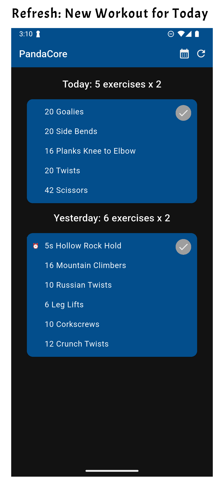

# PandaFit App

A simple mobile app built with Flutter that makes fitness workouts engaging and fun, with something new each day. Meant to be a no-frills, offline app, not requiring creation or access to any accounts.

This app lets you generate personalized workouts for different muscle groups each day, includes a built-in timer, lets you see your workout history, and makes it easy to log and track your progress with smart weight suggestions.

## Features

- **Three workout types**: Upper Body, Lower Body, and Core workouts
  - **Upper & Lower Body**: Separate exercise cards with weight tracking, progressive overload suggestions, and automatic rep range recommendations
  - **Core**: Single workout card format with all exercises displayed together, includes yesterday's catchup option
- **Smart workout generator**: Generates randomized daily workouts with volume-based scaling and deterministic seeding (same workout for the same day so you can do the same exercises together with a friend!)
- **Exercise timer**: Built-in countdown timer for timed exercises (planks, holds) with progress indicator and audio alarm
- **Activity log**: Tracks completed workouts by muscle group in a calendar view with separate tabs for each workout type
- **Progress tracking**: View exercise history with weight and rep progression in the Upper Body and Lower Body tabs
- **Progress import and export**: Import and export workout history as CSV files
- **Yesterday's catchup**: Core workouts allow completing yesterday's missed workout
- **Video links**: Each exercise includes a YouTube video link for proper form demonstration

## Screenshots
<div style="text-align: left;">
  
  
  
  
  
  
  
  
  
</div>

## Getting Started

### Prerequisites

- **Flutter** is required to build the app for both Android and iOS. To install Flutter, follow the instructions on the official Flutter website: [Flutter Installation Guide](https://flutter.dev/docs/get-started/install).
- **Android SDK** is needed to develop and run the app on Android devices. The Android SDK is included with Android Studio. Download and install **Android Studio**: [Download Android Studio](https://developer.android.com/studio).
- Once you have Flutter and the required SDKs installed, run `flutter doctor` to check for any missing dependencies and verify your environment setup.

### Installation

1. Clone the repository:
   ```bash
   git clone https://github.com/AMWen/pandafit.git
   cd pandafit
    ```

2. Install dependencies:
```bash
flutter pub get
```

3. Once you're ready to release the app, you can generate a release APK using the following commands:

For android:
```bash
flutter build apk --release
```

See instructions for [Signing the App for Flutter](https://docs.flutter.dev/deployment/android#sign-the-app) and [Uploading Native Debug Symbols](https://stackoverflow.com/questions/62568757/playstore-error-app-bundle-contains-native-code-and-youve-not-uploaded-debug)

You may also need to remove some files from the bundle if using a MacOS.
```bash
zip -d Archive.zip "__MACOSX*"
```

For iOS (need to create an an iOS Development Certificate in Apple Developer account):
```bash
flutter build ios --release
```

## Workout Types

### Upper Body & Lower Body Workouts
- Individual exercise cards for each exercise
- Track weight and completed sets per exercise
- Smart weight suggestions based on workout history with progressive overload
- Auto-populated rep counts based on rep range
- Completion tracked per muscle group
- History shows weight progression over time

### Core Workouts
- Single workout card displaying all exercises
- Deterministic daily generation (same workout for the same day)
- Volume-based scaling for varying difficulty
- Includes today's and yesterday's workouts for catchup
- Timed exercises with built-in countdown timer (⏰ icon)
- Completion tracked separately in calendar view

## Project Structure

```bash
lib/
├── data/
│   ├── models/
│   │   ├── exercise_model.dart          # Upper/Lower body exercise & routine models
│   │   └── core_exercise_model.dart     # Core exercise & routine models
│   ├── services/
│   │   ├── localdb_service.dart         # SQLite database with workout & core workout methods
│   │   ├── workout_generator.dart       # Upper/Lower body workout generator
│   │   └── core_workout_generator.dart  # Core workout generator with volume scaling
│   ├── widgets/
│   │   ├── exercise_card_widget.dart         # Individual exercise card for upper/lower
│   │   ├── core_workout_card_widget.dart     # Single card for all core exercises
│   │   ├── countdown_widget.dart             # Timer widget for timed exercises
│   │   └── panda_streak_widget.dart          # Workout streak display
│   └── constants.dart                        # Exercise database & core exercise pool
├── screens/
│   ├── home_screen.dart                 # Main screen with 4 tabs (Upper/Lower/Core/History)
│   └── history_screen.dart              # Calendar view with progress tracking
├── utils/
│   └── file_utils.dart                  # CSV import/export utilities
└── main.dart
assets/
└── sounds/
    └── alarm.mp3
pubspec.yaml
```

## Database Structure

The app uses SQLite to store workout data with the following schema:

```sql
workout_logs (
  id INTEGER PRIMARY KEY AUTOINCREMENT,
  date TEXT UNIQUE,
  target_area TEXT,  -- e.g., "Upper Body + Core"
  exercises TEXT     -- JSON array containing both regular exercises and core workouts
)
```

### Data Format
- **Regular exercises**: Stored as JSON objects with fields: `name`, `muscleGroup`, `targetMuscles`, `sets`, `reps`, `weight`, `completedSets`, etc.
- **Core workouts**: Stored as JSON objects with special flag: `{isCore: true, sets, exercisesPerSet, exercises: [...]}`
- Multiple workout types can be stored for the same date by appending to the exercises array